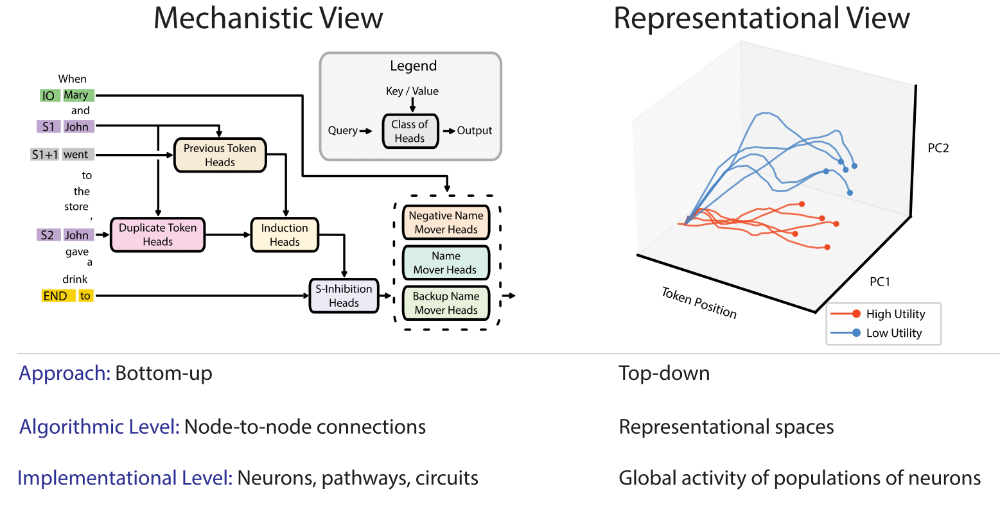

# Representation Engineering (RepE)
This code is based on the following paper: "[Representation Engineering: A Top-Down Approach to AI Transparency](https://arxiv.org/abs/2310.01405)"  
by [Andy Zou](https://andyzoujm.github.io/), [Long Phan](https://longphan.ai/), [Sarah Chen](https://www.linkedin.com/in/sarah-chen1/), [James Campbell](https://www.linkedin.com/in/jamescampbell57), [Phillip Guo](https://www.linkedin.com/in/phillip-guo), [Richard Ren](https://github.com/notrichardren), [Alexander Pan](https://aypan17.github.io/), [Xuwang Yin](https://xuwangyin.github.io/), [Mantas Mazeika](https://www.linkedin.com/in/mmazeika), [Ann-Kathrin Dombrowski](https://scholar.google.com/citations?user=YoNVKCYAAAAJ&hl=en), [Shashwat Goel](https://in.linkedin.com/in/shashwatgoel42), [Nathaniel Li](https://nat.quest/), [Michael J. Byun](https://www.linkedin.com/in/michael-byun), [Zifan Wang](https://sites.google.com/west.cmu.edu/zifan-wang/home), [Alex Mallen](https://www.linkedin.com/in/alex-mallen-815b01176), [Steven Basart](https://stevenbas.art/), [Sanmi Koyejo](https://cs.stanford.edu/~sanmi/), [Dawn Song](https://dawnsong.io/), [Matt Fredrikson](https://www.cs.cmu.edu/~mfredrik/), [Zico Kolter](https://zicokolter.com/), and [Dan Hendrycks](https://people.eecs.berkeley.edu/~hendrycks/).

Check out our [website and demo here](https://www.ai-transparency.org/).



## Installation

To install `repe` from the github repository main branch, run:

```bash
git clone https://github.com/andyzoujm/representation-engineering.git
cd representation-engineering
pip install -e .
```
## Quickstart

Our RepReading and RepControl pipelines inherit the [🤗 Hugging Face pipelines](https://huggingface.co/docs/transformers/main_classes/pipelines) for both classification and generation.

```python
from repe import repe_pipeline_registry # register 'rep-reading' and 'rep-control' tasks into Hugging Face pipelines
repe_pipeline_registry()

# ... initializing model and tokenizer ....

rep_reading_pipeline =  pipeline("rep-reading", model=model, tokenizer=tokenizer)
rep_control_pipeline =  pipeline("rep-control", model=model, tokenizer=tokenizer, **control_kwargs)
```

## RepReading and RepControl Experiments
Check out [example frontiers](./examples) of Representation Engineering (RepE), containing both RepControl and RepReading implementation. We welcome community contributions as well!

## RepE_eval
We also release a language model evaluation framework [RepE_eval](./repe_eval) based on RepReading that can serve as an additional baseline beside zero-shot and few-shot on standard benchmarks. Please check out our [paper](https://arxiv.org/abs/2310.01405) for more details.
